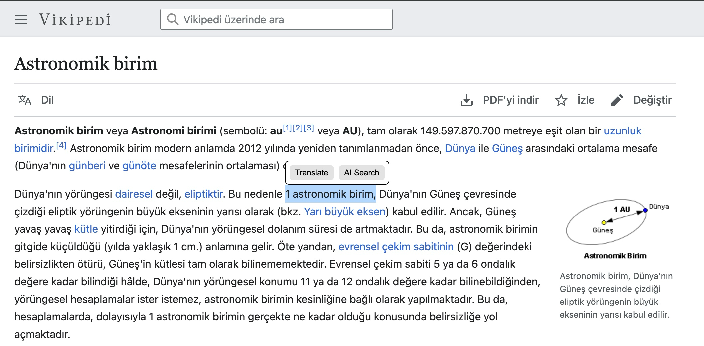

# 📘 TextLens

**TextLens** is a lightweight and smart browser extension that enhances your reading experience by showing contextual action buttons when you select text on any webpage.

With a simple text selection, you can:
- 🌍 Instantly **translate** the selected text
- 🤖 Get **AI-powered insights** or explanations
- ⚡ Enjoy a blazing fast UI built with **Vue 3 + Vite + Manifest V3**

---

## 🚀 Features

- 🖱️ Detects selected text on any page
- 💬 Displays floating `Translate` and `AI Search` buttons
- ⚡ Fast and reactive interface with Vue 3 Composition API
- 🧩 Manifest V3 compliant
- 🌐 Supports Chromium-based browsers (Chrome, Edge, Brave) and Safari (via WebExtension)

---

## 📸 Preview




---

## 🧩 Installation (User Guide)

### ✅ Chrome / Edge / Brave

1. Clone or download this repository
2. Run the following in your terminal:
   ```bash
   npm install
   npm run build
   ```
3. Go to `chrome://extensions`
4. Enable **Developer Mode** (top right)
5. Click **Load Unpacked**
6. Select the `/dist` folder

> For Safari, use Xcode to convert this WebExtension.

---

## 🛠️ Development (Contributor Guide)

### 🔧 Tech Stack

| Layer     | Technology     |
|-----------|----------------|
| UI        | Vue 3 + Composition API |
| Build     | Vite           |
| Extension | Manifest V3    |
| Styling   | Scoped CSS     |
| Format    | IIFE (No `import` errors) |

### ⚙️ Dev Scripts

```bash
# Install dependencies
npm install

# Build extension for /dist
npm run build
```

---

## 🧠 How It Works

1. `content.js` runs in every web page context.
2. It injects a Vue widget (`widget.js`) into the page DOM.
3. When the user selects any text:
    - A floating button group appears near the selection.
    - Two buttons are shown: **Translate** and **AI Search**.
4. Clicking:
    - `Translate`: sends the text to a translation API (e.g. LibreTranslate).
    - `AI Search`: sends the text to OpenAI GPT or any AI api for contextual understanding.

---

## 📅 Roadmap

- [x] Display UI when text is selected
- [x] Build floating UI with Vue 3
- [x] Chromium browser support
- [ ] Add translation functionality
- [ ] Add AI search using
- [ ] Detect source language automatically
- [ ] Add dark mode support
- [ ] Add extension popup for settings
- [ ] Add context menu item (right-click)
- [ ] Port to Safari via Xcode

---

## 💡 Usage Example

1. Visit any webpage.
2. Select a piece of text.
3. A small floating popup appears with two buttons:

```
+------------------------+
| Translate | AI Search |
+------------------------+
```

4. Click **Translate** → Instantly get the translation.
5. Click **AI Search** → Ask GPT about the selected content.

---

## 🔐 API Integration (Optional)

To enable full functionality:

| Feature     | API/Service       | Setup Notes                         |
|-------------|-------------------|--------------------------------------|
| Translate   | LibreTranslate    | Free and open-source, no API key required |
| AI Search   | OpenAI GPT-4      | Requires API key from https://platform.openai.com |

> 🚨 Important: Never expose your API key in `content.js`. Use background scripts or proxy server if needed.

---

## 🙋‍♂️ Author

Built by [@mustafagoktugibolar](https://github.com/mustafagoktugibolar)

> “Point. Click. Understand.”

---

## 📄 License

MIT License

---

## ⭐️ Like this project?

Give it a ⭐️ and share your feedback! Contributions welcome.